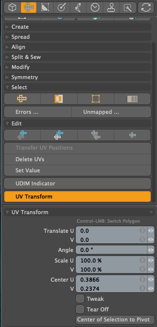

# UV Transform tool for Modo plug-in

<b>UV Transform</b> is a tool for moving, rotating, and scaling UV values ​​in both the UV view and the 3D view. It allows you to modify the UV values ​​mapped to polygons selected in the 3D view, using a designated reference polygon as a basis. When the Tweak option is enabled, dragging an element (polygon, edge, or vertex) with the mouse cursor modifies the UV values ​​mapped to that element.

The reference polygon is the polygon displayed in magenda triangle in the 3D view; you can change it by clicking on a polygon by the Left Mouse Button (LMB).

This kit contains a direct modeling tool for Modo macOS and Windows.

## Installing

- Download lpk from releases. Drag and drop it into your Modo viewport. If you're upgrading, delete previous version.

## How to use UV Transform tool

- The tool version of UV Transform can be launched from **UV Transform** button on **UV** ToolBar on left.

## Basic Usage with UV Transform tool

- Activate **UV Transform** button on **UV** tab of **Model** Modo toolbar.

